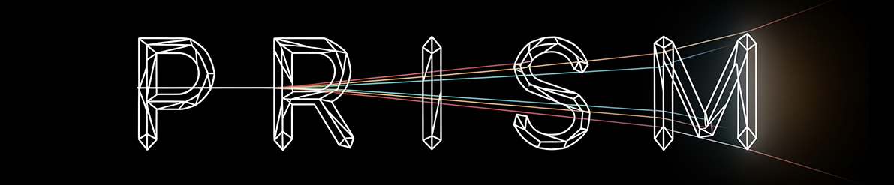

<h1 align="center">
  <span style="font-family: Consolas;">PriSM: Prior-Guided Search Methods for Query Efficient Adversarial Black-Box Attacks</span>
</h1>

<div align="center">
  <a href="https://www.linkedin.com/in/pavlosdais/" target="_blank">Pavlos Ntais</a><sup>1</sup> &ensp; <b>&middot;</b> &ensp;
  <a href="https://scholar.google.com/citations?user=Ro0CzSMAAAAJ&hl=en" target="_blank">Thanassis Avgerinos</a><sup>1</sup> (Supervisor)
  <br>
  <sup>1</sup> National and Kapodistrian University of Athens, Department of Informatics and Telecommunications
</div>
<br>



**TL;DR**:
Adversarial attacks against black-box models face a fundamental trade-off between attack success rate and query efficiency. This work introduces **PriSM**, a framework containing two novel hybrid attack methods that leverage transfer-based priors from surrogate models to significantly improve query efficiency while maintaining high success rates. We first propose TGEA, which uses transfer-based attacks to provide a high-quality initial population for an evolutionary search. We then develop SGSA, an advanced attack that uses the surrogate's gradients to create a saliency map, intelligently guiding the location and size of perturbations at every step of the search process. Both methods bridge the gap between transfer learning and query-based optimization, establishing new benchmarks for query-efficient adversarial attacks.

---

### Contributions
* **Hybrid Approach**: Our work bridges the gap between transfer learning and query-based optimization, leveraging the strengths of both methods with 2 unique ways.
* **Transfer Guided Evolutionary Attack (TGEA)**: The TGEA framework effectively "warm-starts" an evolutionary algorithm, ensuring the search begins closer to the target model's decision boundary.
* **Saliency Guided Square Attack (SGSA)**: SGSA replaces the random search of the state-of-the-art [**Square Attack**](<https://arxiv.org/abs/1912.00049>) with intelligent saliency-map guidance. It uses a surrogate's saliency map to focus on vulnerable regions, adapt the perturbation size, and dynamically update its strategy.
* **Improved Query Efficiency**: Both frameworks *significantly* reduce the number of queries needed to find a successful attack compared to random-search baselines.

---

### Method Overview
#### Transfer Guided Evolutionary Attack (TGEA)
TGEA leverages successful transfer-based attacks to initialize the population of an evolutionary algorithm. This approach ensures that the optimization process starts from adversarial examples that are already close to the target model's decision boundary, significantly reducing the number of queries needed for convergence.

#### Saliency Guided Square Attack (SGSA)
SGSA enhances the Square Attack by incorporating gradient-based saliency maps from a surrogate model. Instead of randomly selecting perturbation locations, SGSA intelligently targets the most vulnerable regions of the input, adapting both the location and magnitude of perturbations throughout the attack process.

---

### How to Use

The full source code is available in this repository. Here is how you can run the attack:

**1. Clone the repository and install dependencies:**
```bash
git clone https://github.com/pavlosdais/PriSM.git
cd src
pip install -r requirements.txt
```

**2. (Optionally) Download CIFAR-10 weights**
```bash
python3 ./models/weights.py --download_weights 1
cp -r ./cifar10_models/state_dicts/ .
```

**3. Run the attack:**
```
python3 attack.py \
  --model 'inception' \
  --dataset 'cifar10' \
  --attack 'TASI'
```

Available Options:
- Models: `model_a`, `model_b`, `vgg`, `inception`
- Datasets: `mnist`, `cifar10`
- Attacks: `TASI`, `SEGI`, `SGSA`

---

This work is conducted as part of my ongoing thesis at the National and Kapodistrian University of Athens, Department of Informatics and Telecommunications, under the supervision of prof. Thanassis Avgerinos.